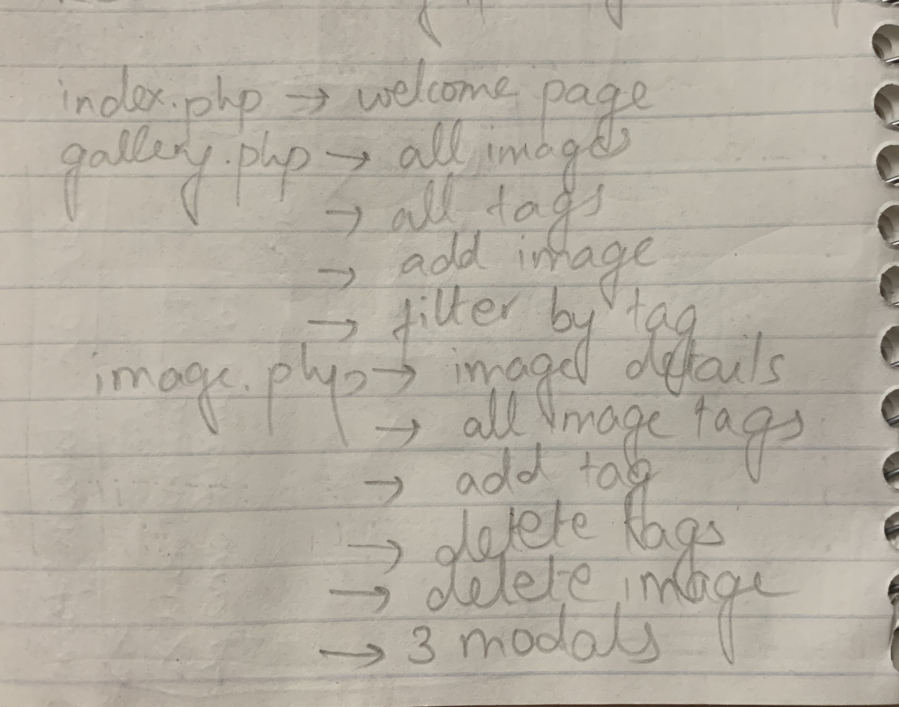

# Project 3: Design Journey

Be clear and concise in your writing. Bullets points are encouraged.

**Everything, including images, must be visible in VS Code's Markdown Preview.** If it's not visible in Markdown Preview, then we won't grade it.

# Design & Plan (Milestone 1)

## Describe your Gallery (Milestone 1)
> What will your gallery be about? 1 sentence.

  My gallery will be about travel destinations categorised by terrain types, continents, countries, and any other tags of the user's choice.

> Will you be using your existing Project 1 or Project 2 site for this project? If yes, which project?

  I will not be using any of my existing projects.

> If using your existing Project 1 or Project 2, please upload sketches of your final design here.

  N/A

## Target Audience(s) (Milestone 1)
> Tell us about your target audience(s).

  My target audience will include people who travel a lot, who like to organize and categorize their vacations, who are travel bloggers, or who simply want to create a bucket list of places they want to visit. My website will be a place for them to organize their travel-related pictures for ready reference in the future and for other visitors who would like to explore different destinations to visualize their vacation spots and perhaps even be inspired and excited to visit certain places. In short, my website will be a go-to gallery for all those who love to travel.

## Design Process (Milestone 1)
> Document your design process. Show us the evolution of your design from your first idea (sketch) to design you wish to implement (sketch). Show us the process you used to organize content and plan the navigation (card sorting), if applicable.
> Label all images. All labels must be visible in VS Code's Markdown Preview.
> Clearly label the final design.

**INITIAL DESIGN**

LIST OF FEATURES REQUIRED AND SORTING





WELCOME PAGE


GALLERY PAGE


ADD IMAGE PAGE


IMAGE DETAILS PAGE


**SECOND ITERATION**

LIST OF FEATURES REQUIRED AND SORTING


WELCOME PAGE


GALLERY PAGE


ADD IMAGE PAGE


IMAGE DETAILS PAGE


MODAL FORMS


**FINAL DESIGN**

LIST OF FEATURES REQUIRED AND SORTING


WELCOME PAGE


GALLERY PAGE


ADD IMAGE PAGE


IMAGE DETAILS PAGE


**I was told that my index.php page is almost unusable on one of my grader's computers. This is how it renders on my computer and is what it should look like.**


## Design Patterns (Milestone 1)
> Explain how your site leverages existing design patterns for image galleries.
> Identify the parts of your design that leverage existing design patterns and justify their usage.
> Most of your site should leverage existing patterns. If not, fully explain why your design is a special case (you need to have a very good reason here to receive full credit).

* Background and font
  - Justification: Leverages existing design patterns where the lightened logo of the website is used as the background on all the pages along with the same font on all the pages for consistency. Indicates to the user that they are on the same website.

* Buttons
  - Justification: Leverages existing design patterns where the buttons change color on hover and the cursor changes to a pointer indicating to the user that the element is clickable. In some cases where the buttons cannot change color (because I have used a donwoaded icon), the buttons expand smoothly. For consistency, other similar buttons also expand smoothly. Buttons have rounded edges as per convention for aestheticism.

* Modal forms
  - Justification: Leverages existing design patterns where the background is darkend when the modal pops up. The cross-off button turns red on hover consistent with existing design patterns. I use modals when the form to be submitted is very short and taking the user to another page would be redundant.

* Adding
  - Justification: Leverages existing design patterns where some submit buttons use words while others don't as per web design conventions. In either case, none of them use the word or shape of the default submit button in HTML.

* Deleting
  - Justification: Leverages existing design patterns where images have symbols instead of the word delete to delete them. This symbol is the trashcan icon. Clicking it opens up a modal message which asks for confirmation.

* Confirmation messages
  - Justification: Leverages existing design patterns where a confirmation message appears in green to indicate to the user that their album/image was successfully added or their album/image was successfully deleted.

* Back button
  - Justification: Leverages existing design patterns where it uses the back arrow intead of words for a back button and does not depend on the browser back button.

* Smooth transitions on hover
  - Justification: Leverages existing design patterns where buttons don't change their look abruptly on hover.

## Requests (Milestone 1)
> Identify and plan each request you will support in your design.
> List each request that you will need (e.g. view image details, view gallery, etc.)
> For each request, specify the request type (GET or POST), how you will initiate the request: (form or query string param URL), and the HTTP parameters necessary for the request.

- Request: View gallery (all images and all tags)
  - Type: GET
  - Initiation: Params
  - Params: id=1 where id = 1 is the tag for all images (will always be displayed when the user first visits gallery.php?id=1)

- Request: View image details (single image and all its tags plus other information)
  - Type: GET
  - Initiation: Params
  - Params: id (gallery.id)

- Request: View images for a tag
  - Type: GET
  - Initiation: Params
  - Params: id (tags.id)

- Request: Add an image
  - Type: POST
  - Initiation: Form
  - Params: N/A; using HTML forms and PHP

- Request: Delete an image
  - Type: POST
  - Initiation: Form
  - Params: N/A; using HTML forms and PHP

- Request: Add a tag to an existing image
  - Type: POST
  - Initiation: Form
  - Params: N/A; using HTML forms and PHP

- Request: Delete an existing tag of an image
  - Type: POST
  - Initiation: Form
  - Params: N/A; using HTML forms and PHP

## Database Schema Design (Milestone 1)
> Plan the structure of your database. You may use words or a picture.
> Make sure you include constraints for each field.

> Hint: You probably need `gallery`, `tags`, and `image_tags` tables.

> Hint: For foreign keys, use the singular name of the table + _id. For example: `gallery_id` and `tag_id` for the `image_tags` table.

```
gallery (
	id: INTEGER {PK, U, Not, AI}
	file_name: TEXT {U, Not}
	caption: TEXT
  date_taken: TEXT
	file_ext: TEXT
)
```

```
tags (
  id: INTEGER {PK, U, Not, AI}
  tag: TEXT
)
```

```
image_tags (
  id: INTEGER {PK, U, Not, AI}
  gallery_id INTEGER {Not},
	tag_id INTEGER {Not},
)
```

## Database Query Plan (Milestone 1)
> Plan your database queries. You may use natural language, pseudocode, or SQL.
> Using your request plan above, plan all of the queries you need.

- Query to view all images
```sql
    SELECT * FROM gallery;
```

- Query to view all tags
```sql
    SELECT * FROM tags;
```

- Query to view all images for a particular tag
```sql
    SELECT * FROM gallery INNER JOIN image_tags ON gallery.id = image_tags.gallery_id WHERE image_tags.tag_id = :tag_id;
```
The `:tag_id` is retrieved from
```sql
    SELECT id FROM tags WHERE tag = :tag_name;
```

- Query to view all details of a single image
```sql
    SELECT * FROM gallery WHERE id = :img_id;
```

- Query to view all tags for a particular image
```sql
    SELECT tags.tag FROM tags INNER JOIN image_tags ON image_tags.tag_id = tags.id WHERE image_tags.gallery_id = :img_id;
```

- Query to add an image
```sql
    INSERT INTO gallery (caption, date_taken, file_ext) VALUES (:caption, :date_taken, :file_ext);
```

- Query to add a new tag
```sql
    INSERT INTO tags (tag) VALUES (:tag);
```

- Query to connect a tag to an image
```sql
    INSERT INTO image_tags (gallery_id, tag_id) VALUES (:gallery_id, :tag_id)
```

- Query to delete an image
```sql
    DELETE * FROM gallery WHERE id= :id
    DELETE * FROM image_tags WHERE image_id = :id
```

- Query to delete a tag from an existing image
```sql
     DELETE * FROM tags WHERE id= :id -- if no images exist in this album
     DELETE * FROM image_tags WHERE tag_id= :id
```

## Code Planning (Milestone 1)
> Plan what top level PHP pages you'll need.

- index.php: Welcome page with a single button that will take the user to the albums page (gallery).
- gallery.php: Albums page which will display all the images as a gallery. It will have the tags or "albums" along the left side as buttons. The user will be able to filter the images by tags or "album" by clicking the respective album buttons. The page will also have a button to add image which will take users to add.php.
- add.php: A page with a form to upload an image.
- image.php: A page with the details of the requested image according to the query string parameters in the link of the page. It will also give users the ability to delete the image through a modal form, and add/remove tags for the image through modal forms.

> Plan what partials you'll need.

- header.php: Contains the name and tagline of the website.

> Plan any PHP code you'll need.

To view details of an image
```
if user clicks on view image link (image.php?id=4), then

    SELECT caption, date_taken, file_ext FROM gallery WHERE id = 4;

    SELECT tags.tag FROM tags INNER JOIN image_tags ON image_tags.tag_id = tags.id WHERE image_tags.gallery_id = :img_id;

    Convert extension to upper case

    Escape output for caption, date_taken, file_ext, and tags

  end
```

To add a tag
```
if user clicks on add tag button, then

    INSERT INTO tags (tag) VALUES (:tag); -- for new tag

    INSERT INTO image_tags (gallery_id, tag_id) VALUES (:gallery_id, :tag_id) -- :tag_id comes from above for new tag and from a search uery for an existing tag. :gallery_id comes from the form;

    trim and filter string.

    if empty {

      display error message through corrective feedback

    }

  end
```


To delete an image
```
if user clicks on delete image link (image.php?action=delete_img&gallery_id=10), then

     DELETE * FROM gallery WHERE id= :id;

     DELETE * FROM image_tags WHERE image_id = :id -- if tag has no images;

  end
```


To delete a tag
```
if user clicks on delete tag link (image.php?action=delete_tag&tag_id=10&gallery_id=4), then

     DELETE * FROM tags WHERE id= :id;

     DELETE * FROM image_tags WHERE tag_id= :id;

  end
```

Filtering
```
if user clicks on a tag (gallery.php?id=10), then

  Change active tag display to name of tag by SELECT tag FROM tags WHERE id = 10;

  SELECT caption FROM gallery INNER JOIN image_tags ON image_tags.gallery_id = gallery.id WHERE image_tags.gallery_id = :tag_id;

  end
```

# Complete & Polished Website (Final Submission)

## Gallery Step-by-Step Instructions (Final Submission)
> Write step-by-step instructions for the graders.
> For each set of instructions, assume the grader is starting from index.php.

Viewing all images in your gallery:
1. Click on "Start storing your memories"
All images are already displayed when the user reaches gallery.php?id=1

View all images for a tag:
1. Click on "Start storing your memories"
2. Click on the tag of your choice from the list on the left of gallery.php
Images displayed are filtered by the tag

View a single image and all the tags for that image:
1. Click on "Start storing your memories"
2. Click on the image you want to view in detail
All details are displayed on image.php?id=:img_id

How to upload a new image:
1. Click on "Start storing your memories"
2. Click on the black image-with-a-plus icon on the top right corner of gallery.php
3. Fill out the the form on add.php
4. Click on "+ Add to gallery"
5. Click "<- Back to gallery on confirmation page"
6. Scroll to the bottom of gallery.php?id=1 to see your image displayed

How to delete an image:
1. Click on "Start storing your memories"
2. Click on the image you want to delete
3. Click on the trashcan icon on the top right corner on the image
4. Click "Yes" on the confirmation modal form
5. Click "<- Back to gallery on confirmation page"
6. Scroll to through gallery.php?id=1 to see that your image has been deleted

How to view all tags at once:
1. Click on "Start storing your memories"
All tags are always displayed along the left on gallery.php

How to add a tag to an existing image:
1. Click on "Start storing your memories"
2. Click on the image you want to add a tag to
3. Click on the "Add to an album" button below the image details
4. Type the name of the album in the modal form
5. Click "Add to image"
The new album appears in the image details' "ALBUMS" row

How to remove a tag from an existing image:
1. Click on "Start storing your memories"
2. Click on the image you want to remove a tag from
3. Click on the "Remove from an album" button below the image details
4. Type the name of the album in the modal form
5. Click "Remove album"
The album is removed in the image details' "ALBUMS" row


## Reflection (Final Submission)
> Take this time to reflect on what you learned during this assignment. How have you improved since starting this class?

 I learnt that the most important part of such projects is having a good database schema which makes implementing functionality easy. However, no matter how easy we try to make it, PHP and SQL is quite stubborn and debugging them is extremely hard. The error messages are often incomprehensive and so we must always write out pseudocode, generously use the `var_dump` function and thoroughly test our website to make sure that our code is doing what we want it to do. Spelling errors often go uncaught by PHP and SQL which leads to incorrect output or broken websites. Thus, one of my biggest takeaways from this project was the ability to debug my code.

 As compared to the start of the semester, I have definitely gained new skills, both in terms of new languages, and in terms of critical thinking, reasoning, and debugging my code. I have a muh better understanding of how dynamic websites work and thus, I am able to leverage my mental model and knowledge about it to write correct code.
